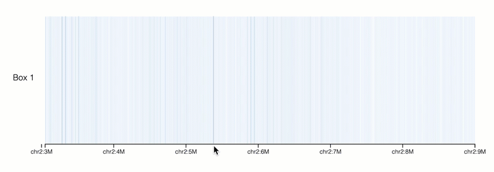

# epiviz.gl

The `epiviz.gl` project is meant to visualize genomic data using webgl and webworkers, in an effort to give a fluid, high-performance user experience. Visualizations are defined via a declarative schema.

**Live demo: https://epiviz.github.io/epiviz.gl/**

# Install

```
$ yarn install git+https://github.com/epiviz/epiviz.gl
```

## Usage

See [app/index.js](https://github.com/epiviz/epiviz.gl/blob/main/app/scripts/index.js) for a more comprehensive example.

```javascript
import WebGLVis from "epiviz.gl";

const container = document.createElement("div");

const visualization = new WebGLVis(container);
visualization.addToDom();
visualization.setSchema({
  defaultData: ["day,price", "1,10", "2,22", "3,35"],
  tracks: [
    {
      mark: "line",
      x: {
        attribute: "day",
        type: "quantitative",
        domain: [1, 10],
      },
      y: {
        attribute: "price",
        type: "quantitative",
        domain: [0, 40],
      },
      color: {
        value: "red",
      },
    },
  ],
});
```

## Features

### Zooming and Panning:

All visualizations automatically include zooming and panning:


### Selection:

All visualizations also include an ability to box or lasso select:


# Schemas

Documentation for schemas can be found in [docs/schema_doc.md](https://github.com/epiviz/epiviz.gl/blob/main/docs/schema_doc.md). Documentation for the schemas can be generated with [json-schema-for-humans](https://pypi.org/project/json-schema-for-humans/):

```
$ cd src/epiviz.gl/schema-validation
$ generate-schema-doc visualization.json --config template_name=md
```

## Examples

### Scatterplot

**Specification:**

```json
{
  "xAxis": "center",
  "yAxis": "center",
  "defaultData": "path/to/tsne.csv",
  "tracks": [
    {
      "mark": "point",
      "x": {
        "attribute": "x",
        "type": "quantitative",
        "domain": [-10, 10]
      },
      "y": {
        "attribute": "y",
        "type": "quantitative",
        "domain": [-10, 10]
      },
      "color": {
        "attribute": "sample",
        "type": "categorical",
        "cardinality": 32,
        "colorScheme": "interpolateRainbow"
      },
      "opacity": { "value": 0.05 }
    }
  ]
}
```


### Box Track

**Specification:**

```json
{
  "margins": {
    "left": "10%"
  },
  "labels": [
    {
      "y": 0.05,
      "x": -1.3,
      "text": "Box 1",
      "fixedX": true
    }
  ],
  "xAxis": "zero",
  "yAxis": "none",
  "defaultData": "path/to/box-track.csv",
  "tracks": [
    {
      "tooltips": 1,
      "mark": "rect",
      "layout": "linear",
      "x": {
        "type": "genomicRange",
        "chrAttribute": "chr",
        "startAttribute": "start",
        "endAttribute": "end",
        "domain": ["chr2:3049800", "chr2:9001000"],
        "genome": "hg38"
      },
      "y": {
        "value": 0
      },
      "height": {
        "value": 10
      },
      "color": {
        "type": "quantitative",
        "attribute": "score",
        "domain": [0, 8],
        "colorScheme": "interpolateBlues"
      }
    }
  ]
}
```



### Line Track

**Specification:**

```json
{
  "defaultData": "path/to/box-track.csv",
  "tracks": [
    {
      "tooltips": 1,
      "mark": "line",
      "layout": "linear",
      "x": {
        "type": "genomic",
        "chrAttribute": "chr",
        "geneAttribute": "start",
        "domain": ["chr2:3049800", "chr2:9001000"],
        "genome": "hg38"
      },
      "y": {
        "type": "quantitative",
        "attribute": "score",
        "domain": [0, 10],
        "colorScheme": "interpolateBlues"
      },
      "color": {
        "type": "quantitative",
        "attribute": "score",
        "domain": [0, 8],
        "colorScheme": "interpolateBlues"
      }
    }
  ]
}
```


### Arc Track

**Specification:**

```json
{
  "xAxis": "zero",
  "yAxis": "none",
  "defaultData": "path/to/arcs.csv",
  "tracks": [
    {
      "mark": "rect",
      "x": {
        "type": "genomicRange",
        "chrAttribute": "region1Chrom",
        "startAttribute": "region1Start",
        "endAttribute": "regionEnd",
        "domain": ["chr2:46000", "chr2:243149000"],
        "genome": "hg19"
      },
      "y": {
        "value": 0
      },
      "height": {
        "value": 10
      },
      "color": {
        "type": "quantitative",
        "attribute": "value",
        "domain": [0, 60],
        "colorScheme": "interpolateBlues"
      },
      "opacity": {
        "value": 0.25
      }
    },
    {
      "mark": "rect",
      "x": {
        "type": "genomicRange",
        "chrAttribute": "region2Chrom",
        "startAttribute": "region2Start",
        "endAttribute": "region2End",
        "domain": ["chr2:38000", "chr2:243149000"],
        "genome": "hg19"
      },
      "y": {
        "value": 0
      },
      "height": {
        "value": 10
      },
      "color": {
        "type": "quantitative",
        "attribute": "value",
        "domain": [0, 60],
        "colorScheme": "interpolateReds"
      },
      "opacity": {
        "value": 0.25
      }
    },
    {
      "mark": "arc",
      "x": {
        "type": "genomicRange",
        "chrAttribute": "region1Chrom",
        "startAttribute": "region1Start",
        "endAttribute": "regionEnd",
        "domain": ["chr2:38000", "chr2:243149000"],
        "genome": "hg19"
      },
      "width": {
        "type": "genomicRange",
        "chrAttribute": "region2Chrom",
        "startAttribute": "region2Start",
        "endAttribute": "region2End",
        "domain": ["chr2:38000", "chr2:243149000"],
        "genome": "hg19"
      },
      "y": {
        "value": 0.1
      },
      "height": {
        "value": 0
      },
      "color": {
        "type": "quantitative",
        "attribute": "value",
        "domain": [0, 60],
        "colorScheme": "interpolateBuGn"
      }
    }
  ]
}
```


# Development

## Prepare the repository

```
$ yarn install
$ yarn build
```

## Use the app

```
$ yarn start
```

Then navigate to `localhost:1234`

## Run the tests

```
$ yarn start
(In a seperate window)
$ npx cypress open
```

Via command line:

```
$ npx cypress run
```

Via GUI:

```
$ npx cypress open
```

This will open an additional window, where tests can be run on a live version of chrome.

### Record the tests

A method of doing of integration tests is to record the state of the application when it is working properly. Then, after making changes, compare the current state of the app and assert the state is equivalent. If it is not equivalent, either something is broken OR it is an anticipated change in which case it is justified to rerecord the tests and commit the change.

Check if current state matches recordings:

```
$ npx cypress run --spec "cypress/integration/expected-images.spec.js"
```

Rerecord the tests:

```
$ npx cypress run --spec "cypress/integration/record-tests.spec.js" --env recording=true
```
